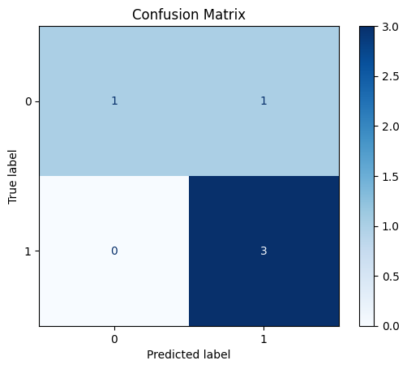

# bug-nonbug-deploy

This project deploys a machine learning model that classifies software issue reports as **Bug** or **Non-Bug**.  
It uses **Flask** for the API and is containerized with **Docker** for portability.  

---

##  Live Demo

🔗 [Click here to try the live app](https://bug-nonbug-deploy.onrender.com)

You can enter the issue title and description on the homepage to receive a classification (**Bug** or **Non-Bug**).  
Or use the `/predict` endpoint directly:

**Request Example**:
```json
{
  "title": "Submit button crash",
  "description": "App crashes when clicking submit with empty form"
}
```

**Response**:
```json
{
  "prediction": "Bug",
  "confidence": 0.87
}
```

---

##  Features
- `/health` → Health check endpoint  
- `/predict` → Predict a single issue report  
- `/predict_batch` → Predict multiple issue reports  
- Simple **HTML frontend** at `/` for quick testing  
- Packaged with **Docker** for easy deployment  

---

## Project Structure
```
bug-nonbug-deploy/
├── app/
│   ├── app.py          # Main Flask application
│   ├── model/          # Trained model (.pkl/.joblib)
│   └── templates/
│       └── index.html  # Simple UI
├── reports/            # Evaluation results
│   ├── confusion_matrix.png
│   └── metrics_summary.md
├── issues.csv          # Training dataset (sample)
├── evaluate.py         # Evaluation script
├── requirements.txt    # Python dependencies
├── Dockerfile          # Container setup
└── README.md           # Project documentation
```

---

##  Setup (Local)

1. **Clone the repo**
   ```bash
   git clone https://github.com/KavithaAncha/bug-nonbug-deploy.git
   cd bug-nonbug-deploy
   ```

2. **Create virtual environment & install deps**
   ```bash
   python3 -m venv .venv
   source .venv/bin/activate
   pip install -r requirements.txt
   ```

3. **Run the app**
   ```bash
   python -m app.app
   ```
   App will be available at → http://127.0.0.1:5000

---

##  Run with Docker

1. **Build the image**
   ```bash
   docker build -t bug-nonbug:1.0 .
   ```

2. **Run the container**
   ```bash
   docker run --rm --name bugapp      -e MODEL_PATH=/app/app/model/bug_classifier_pipeline.pkl      -p 8000:5000 bug-nonbug:1.0
   ```
   App will be available at → http://127.0.0.1:8000

---

##  Results

- **Accuracy**: 0.80  
- **Precision (Bug)**: 0.75  
- **Recall (Bug)**: 1.00  
- **F1 Score (Bug)**: 0.86  
- **Macro Avg F1**: 0.76  
- **Weighted Avg F1**: 0.78  

(See [metrics_summary.md](reports/metrics_summary.md) for full details)

Confusion Matrix:  


---

## API Endpoints

### ➤ Health check
```bash
curl http://127.0.0.1:8000/health
```
Response:
```json
{"status": "ok", "model_loaded": true}
```

### ➤ Single prediction
```bash
curl -X POST http://127.0.0.1:8000/predict   -H "Content-Type: application/json"   -d '{"title": "Submit button crash", "description": "App crashes when clicking submit"}'
```
Response:
```json
{"prediction": "Bug", "confidence": 0.87}
```

### ➤ Batch prediction
```bash
curl -X POST http://127.0.0.1:8000/predict_batch   -H "Content-Type: application/json"   -d '{"items": [{"title": "UI alignment", "description": "Minor text alignment issue"}]}'
```
Response:
```json
{"results":[{"index":0,"prediction":"Non-Bug","confidence":0.65}]}
```

---

## Documentation
- API implemented in `app/app.py` using Flask  
- Simple frontend in `app/templates/index.html`  
- Extendable with Swagger/Postman for API testing  

---

## Dataset and Training
- Training dataset: [`issues.csv`](./issues.csv)  
- Preprocessed text → TF-IDF → Logistic Regression classifier  

---

## Limitations & Future Work
- Currently limited to binary classification (Bug vs Non-Bug).  
- Could extend with BERT/transformer-based NLP models.  
- Potential for active learning loop to improve with new issues.  

---

## Author
**Kavitha Ancha**  
Capstone Project — Machine Learning Engineering Bootcamp
